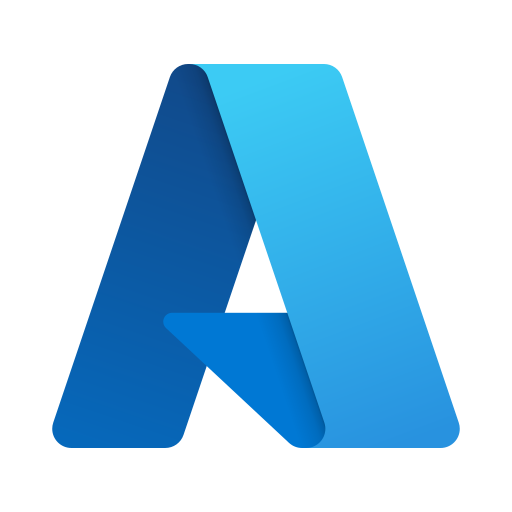

# Hola, mi nombre es Juan Rodríguez Garcés :wave:
### Azure & AWS Data Engineer

Soy Ingeniero de Datos con más de 5 años de experiencia en el desarrollo de soluciones de Big Data sobre las nubes de Azure y AWS. Mi experiencia incluye la creación de pipelines de datos automatizados para la extracción, transformación, almacenamiento y análisis de datos, así como la implementación de arquitecturas escalables y fiables en la nube.

Me considero una persona proactiva, con habilidades de comunicación eficaces, resolución de problemas, aprendizaje autónomo y gran capacidad de trabajo en equipo. Estoy seguro de que puedo aportar gran valor a través de mi experiencia y conocimientos en el campo de la Ingeniería de Datos.

## TECNOLOGÍAS:

	
	
	
	
	
	
	
	
	

# PROYECTOS ELABORADOS

## FINTECH - CÁLCULO DE COMISIONES MENSUALES PARA CLIENTES B2B - AZURE (DATA FACTORY | DATABRICKS | DATA LAKE STORAGE)

## FINTECH - CÁLCULO DE COSTOS TOTALES PARA CLIENTES B2B Y B2C - AZURE (DATA FACTORY | DATABRICKS | DATA LAKE STORAGE)

## FINTECH - CÁLCULO DE COMISIONES PARA CLIENTES B2B - AWS (GLUE | S3 | REDSHIFT | DYNAMODB | ATHENA)

## FINTECH - CÁLCULO DE COSTOS TOTALES PARA CLIENTES B2B Y B2C - AWS(GLUE | S3 | REDSHIFT | DYNAMODB | ATHENA)

## CONTACTO

 

 
[_322_602_1296_&_(+57)_310_449_4107-0077B5?style=for-the-badge&logo=whatsapp&logoColor=white&labelColor=101010)](https://web.whatsapp.com)

